## Pembuka

Assalamu'alaikum, teman-teman semua. Semoga harinya menyenangkan, ya! Di tutorial pertama ini, kita akan membahas hal yang paling mendasar yaitu, gimana caranya memulai mengetik di Word dengan rapi. Harapannya nih, kalau cara ngetik kita sudah bagus dari awal, kerjaan kita akan jadi lebih cepat selesai dan hasilnya pun akan lebih profesional. Yuk, kita mulai!

## Membuka Microsoft Word dan Membuat Dokumen Kosong

Bagaimana cara membuka aplikasi Microsoft Word? Caranya mudah banget kok. Kita bisa langsung klik dua kali pada ikon Word di desktop atau mencarinya di tombol Start.

### Klik Dua Kali Ikon Microsoft Word

Coba cari di desktop layar komputer teman-teman, ikon yang berwarna biru dan ada huruf **W**-nya seperti ini dan klik dua kali.

<figure style="text-align: center;">
  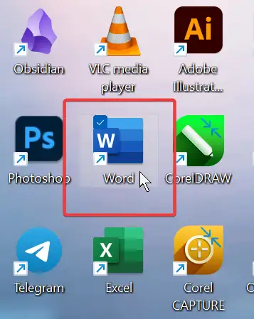
  <figcaption>Gambar 1: Klik Ikon Word</figcaption>
</figure>

### Mencari di Tombol Start

Ketik saja di kotak pencarian yang ada di samping tombol start "Word", kemudian klik satu kali saja pada ikon Word berikut.

<figure style="text-align: center;">
  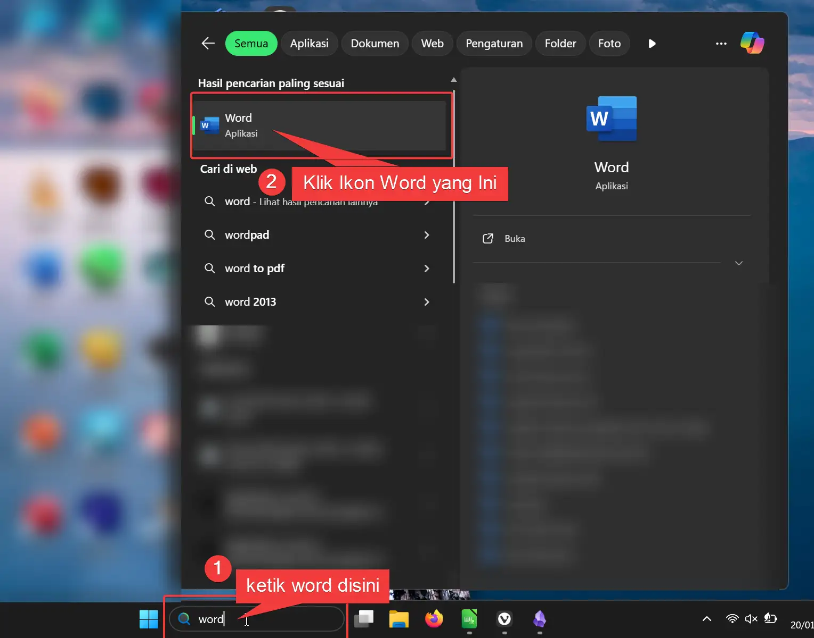
  <figcaption>Gambar 2: Mencari Word Lewat Menu Start</figcaption>
</figure>

### Membuat Dokumen Baru

Setelah Word terbuka tampilannya akan seperti di bawah ini. Klik saja **Blank document** untuk membuat dokumen kosong yang baru.

<figure style="text-align: center;">
  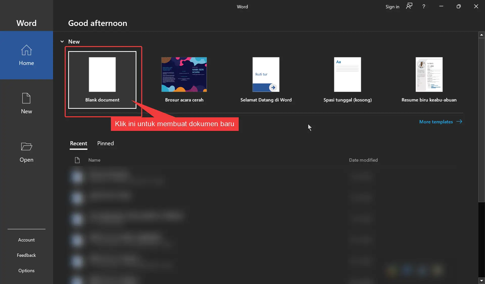
  <figcaption>Gambar 3: Tampilan Awal Word</figcaption>
</figure>

## Memulai Mengetik

Nah, kalau dokumen baru sudah dibuat, nanti tampilannya akan seperti di bawah ini. Teman-teman bisa lihat ada garis tegak tipis yang kelap-kelip di sebelah kiri atas. Itu namanya **Kursor**, kursor ini fungsinya itu sebagai penanda, jadi dia ngasih tahu kita, tulisan yang diketik itu akan muncul dimana.

<figure style="text-align: center;">
  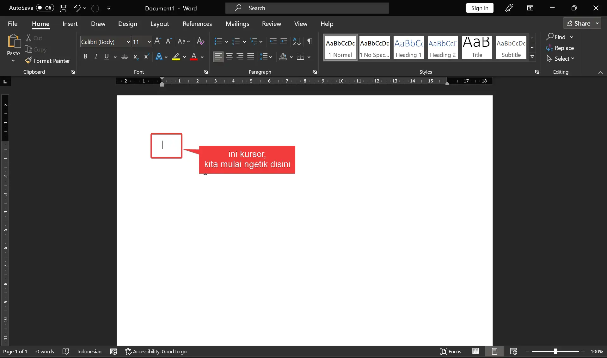
  <figcaption>Gambar 4: Dokumen Kosong Word</figcaption>
</figure>

Sekarang cobalah ketik teks di bawah ini.

> "Halo semuanya! Nama saya adalah [Tulis Nama Kamu Disini Ya!]. Saat ini, saya sedang duduk di depan komputer untuk belajar mengetik. Latihan pertama ini aku akan belajar tombol dasar yang sering digunakan saat aku ngetik nih. Sekarang aku ingin buat paragraf baru dengan cara tekan tombol Enter di keyboard."
>
> "Nah sekarang kita sudah sampai di paragraf kedua. Mari kita kenalan dengan tombol Shift. Tombol Shift ini jika kita tekan bersamaan dengan tombol huruf yang lain, nanti huruf nya jadi kapital loh, seperti tadi saat kita menulis nama disini, [Ayo tulis lagi nama kamu disini, tapi pastikan satu huruf depan tiap kalimatnya adalah huruf kapital ya]. Selain itu tombol Shift juga digunakan untuk mengetik simbol tambahan seperti tanda seru ! dan petik dua seperti tadi ". [Sampai disini tolong diperhatikan tanda baca serta penempatan huruf kapitalnya ya].
>
> "Sekarang lanjut di paragraf ketiga, kita kenalan dengan tombol Caps Lock. Biasanya kita pakai tombol ini untuk membuat huruf menjadi besar atau kita sedang marah-marah, coba ditekan. NAH SUDAH YAH? JANGAN LUPA TEKAN SEKALI LAGI KALAU HURUFNYA MAU KECIL KEMBALI. Sampai di sini cukup seru kan?"
>
> "Oh iya, tadi ada salah ketik tidak? Kalau ada salah ketik tekan aja tombol Backspace yang ada di pojok kanan atas keyboard. Kalau tidak ada, coba hapus satu paragraf ini ya, untuk mencoba tombol itu, tapi nanti jangan lupa diketik lagi."

Nanti hasil akhirnya akan seperti ini.

<figure style="text-align: center;">
  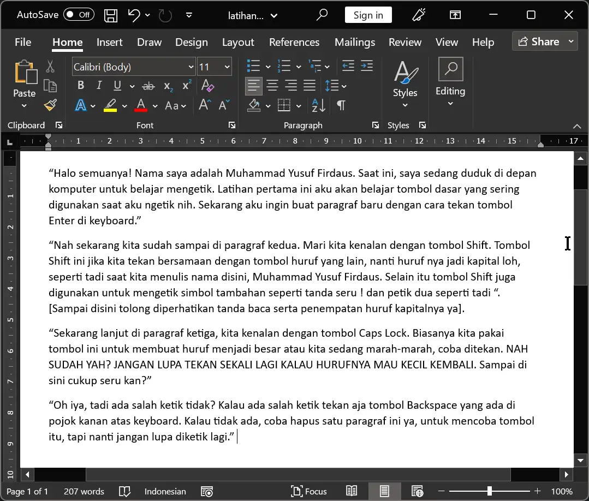
  <figcaption>Gambar 5: Jawaban</figcaption>
</figure>

Bagaimana teman-teman sampai di sini sudah bisa ya? Sekarang saya akan tambahin beberapa hal yang belum masuk di latihan pertama tadi:

1. Tadi saya belum kasih tahu cara menambah spasi ya, untuk menambah spasi tekan tombol **Space Bar** yang paling panjang itu.
2. **Shift** dan **Caps Lock** bisa membuat huruf menjadi besar, namun mereka berbeda.
   - Kalau **Caps Lock** cukup ditekan sekali lalu lepas untuk membuat huruf kapital, dan tekan sekali lagi untuk mematikannya agar huruf kembali normal.
   - **Shift** perlu ditekan bersama-sama agar hurufnya jadi kapital, jadi kalau dilepas tombol Shift-nya hurufnya akan kembali normal. Selain itu Shift juga digunakan untuk mengetik beberapa tanda baca atau simbol. Jika dalam satu tombol ada dua karakter, untuk mengetik karakter yang di atas kita perlu pakai Shift. Misalnya tanda seru (`!`) berarti tekan `Shift` + `1`, kutip dua (`"`) berarti tekan `Shift` + `'`, atau tanda `@` berarti tekan `Shift` + `2`.
3. Ada dua tombol untuk menghapus yaitu `Backspace` dan `Delete`.
   - `Backspace` akan menghapus yang ada di sebelah kiri kursor.
   - `Delete` menghapus yang ada di sebelah kanan kursor.
4. Jangan lupa tambahkan spasi setelah tanda baca agar tulisan kita rapi dan sesuai kaidah Bahasa Indonesia.
5. Jika ingin memperbaiki tulisan yang ada di tengah paragraf, klik dulu pakai mouse di bagian yang mau diperbaiki agar kursornya pindah dulu, setelah itu baru diperbaiki.
6. Untuk membuat paragraf baru, cukup tekan Enter sekali saja. Kalau lebih dari sekali nanti jarak paragrafnya akan semakin jauh. Dan tidak perlu tekan `Alt` + `Enter` — cukup tekan Enter saja untuk membuat paragraf atau baris baru.
7. Kalau teman-teman melihat ada garis berwarna merah di bawah tulisan, itu fitur Word yang menandakan ejaan salah. Boleh diabaikan kalau sudah yakin tulisannya benar, karena saat di-print atau diekspor ke PDF garis merah itu tidak akan kelihatan.

## Menyimpan File

Setelah selesai latihan pertama, jangan lupa disimpan ya agar bisa dibuka lagi nanti. Berikut langkah-langkahnya.

#### Langkah 1: Cek Judul Dokumen

Biasanya kalau belum disimpan, judul dokumen di bagian atas akan tertulis **Document1**, **Document2**, dan seterusnya.

<figure style="text-align: center;">
  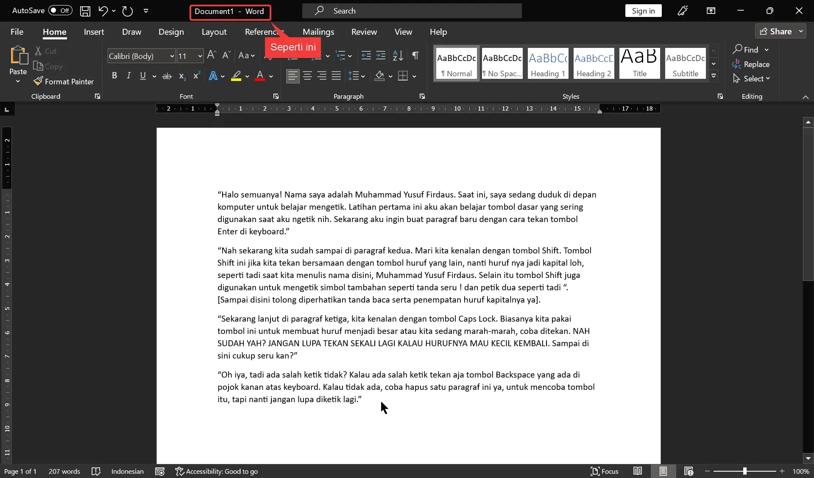
  <figcaption>Gambar 6: Dokumen Belum Disimpan</figcaption>
</figure>

#### Langkah 2: Klik Menu File

Klik menu **File** yang ada di pojok kiri atas.

<figure style="text-align: center;">
  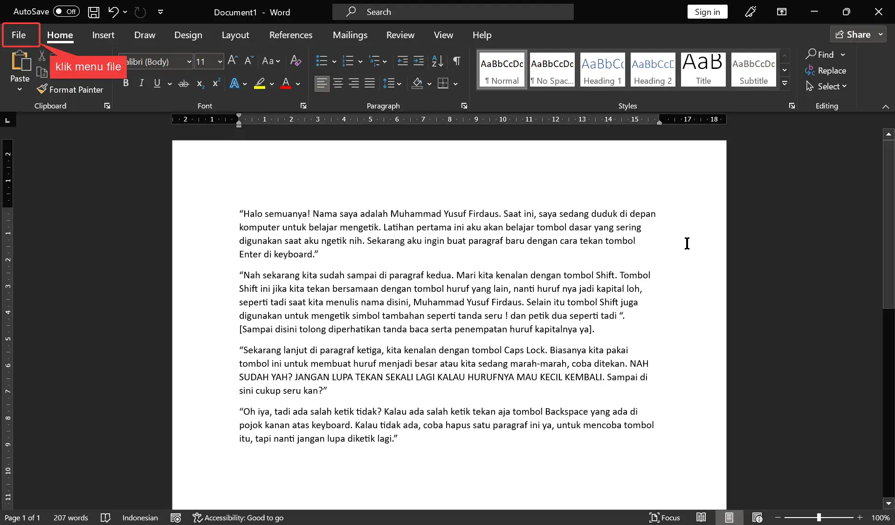
  <figcaption>Gambar 7: Klik Menu File</figcaption>
</figure>

#### Langkah 3: Pilih Save

Kemudian klik pilihan **Save**.

<figure style="text-align: center;">
  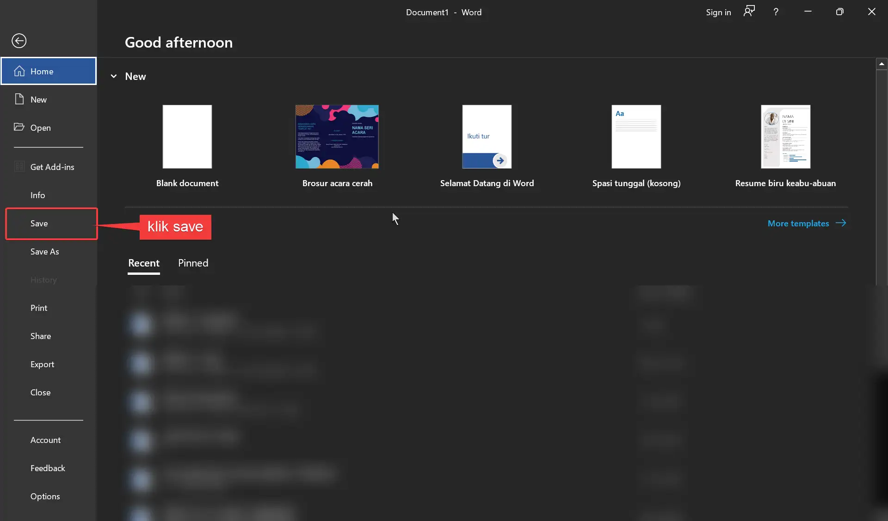
  <figcaption>Gambar 8: Klik Save</figcaption>
</figure>

#### Langkah 4: Cari Folder (Browse)

Klik **Browse** dan cari folder tempat menyimpan latihan. Saya sarankan simpan di folder **Dokumen** agar gampang dicari.

Lalu buatlah folder baru dengan nama **Belajar** dengan cara:

<figure style="text-align: center;">
  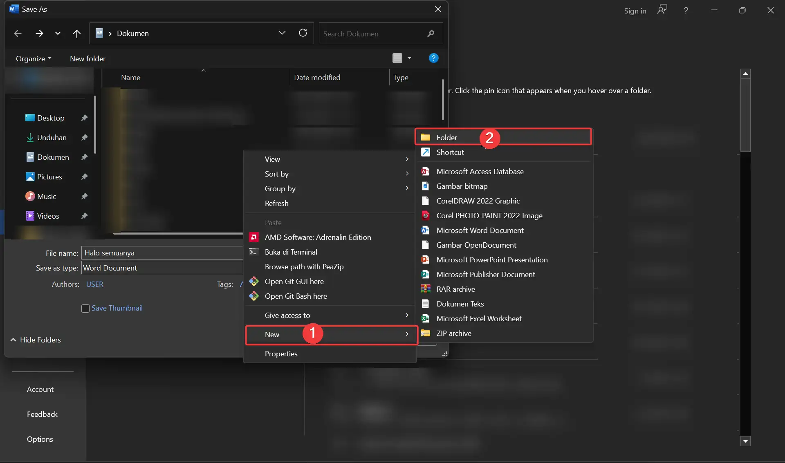
  <figcaption>Gambar 9: Buat Folder</figcaption>
</figure>

1. Klik kanan mouse.
2. Pilih **New**, lalu pilih **Folder**.
3. Ganti nama folder baru itu dengan nama **Belajar**.

<figure style="text-align: center;">
  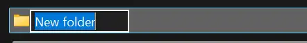
  <figcaption>Gambar 10: Ganti Nama Folder</figcaption>
</figure>

4. Masuk ke folder **Belajar** dengan klik dua kali.
5. Buat lagi folder dengan nama **Word** dengan cara yang sama, lalu masuk ke folder **Word** itu.

#### Langkah 5: Ubah Nama File

Di bagian bawah samping **File name**, ubah nama filenya menjadi sesuatu yang deskriptif seperti `latihan 1 memulai mengetik` agar gampang dicari nanti.

<figure style="text-align: center;">
  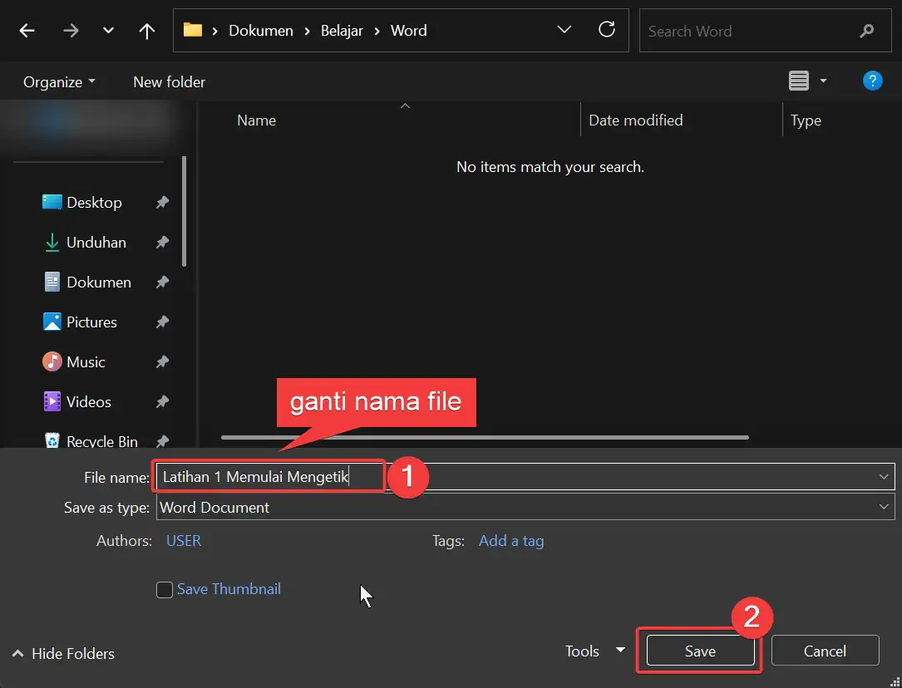
  <figcaption>Gambar 11: Ganti Nama File</figcaption>
</figure>

#### Langkah 6: Klik Save

Klik tombol **Save** di pojok kanan bawah. Selesai!

## Ekspor ke PDF

Setelah latihan disimpan dan isinya sudah rapi, sekarang ayo kita coba ubah dokumen Word ke PDF. Untuk apa kita jadikan PDF? PDF adalah singkatan dari *Portable Document Format*. Kelebihannya adalah jika teman-teman membuka file PDF dari komputer atau HP lain, tampilannya tidak berantakan dan masih sama persis seperti yang dibuat. Karena itu, format ini sering dipakai untuk tugas, laporan, atau dokumen resmi.

Dari pengalaman saya, bahkan kalau membuka di versi Microsoft Office yang berbeda pun format dokumen bisa berantakan. Jadi saya sering ubah dulu ke PDF agar aman saat mau print.

#### Langkah 1: Klik Menu File

Klik menu **File** yang ada di pojok kiri atas.

#### Langkah 2: Pilih Save As

Pilih **Save As**. Ada perbedaan antara **Save** dan **Save As** — nanti akan saya jelaskan.

#### Langkah 3: Pilih Browse

Tentukan di mana mau simpan file PDF. Saya sarankan di folder yang sama dengan latihan 1, yaitu **Dokumen > Belajar > Word**.

<figure style="text-align: center;">
  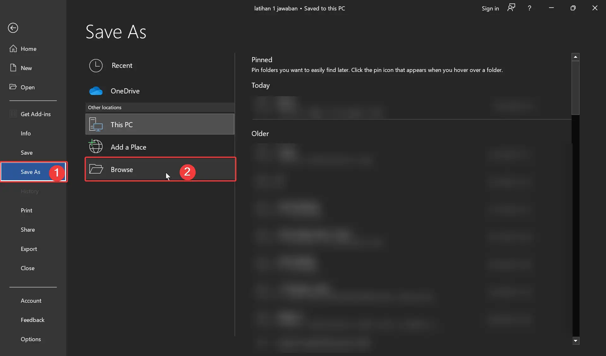
  <figcaption>Gambar 12: Save As</figcaption>
</figure>

#### Langkah 4: Ubah Tipe File

Di bawah kotak nama file, ada kotak pilihan **Save as type**. Klik di situ kemudian cari dan pilih **PDF**.

<figure style="text-align: center;">
  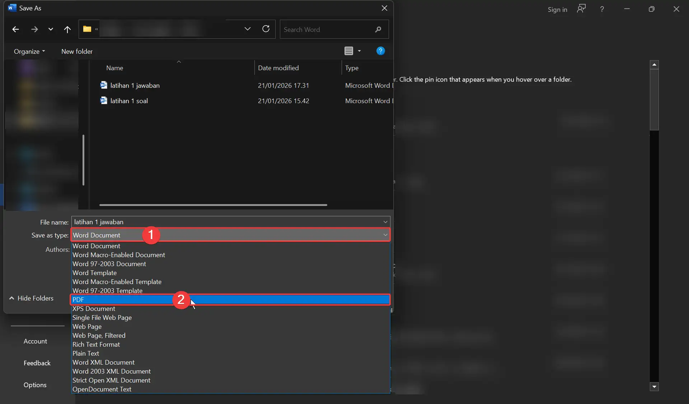
  <figcaption>Gambar 13: Ubah Tipe File</figcaption>
</figure>

#### Langkah 5: Klik Save

Klik **Save**. Sekarang kamu sudah punya dua file — Word yang masih bisa diedit, dan PDF yang siap dikirim atau dicetak.

## Perbedaan Save dan Save As

Di bagian sebelumnya kita telah menggunakan **Save** dan **Save As**, tapi sebenarnya apa perbedaan di antara keduanya?

- **Save (Simpan)**: Menyimpan perubahan ke file yang sama. File, nama, dan folder tetap sama — hanya isinya yang diperbarui dengan versi terbaru.

- **Save As (Simpan Sebagai)**: Digunakan bila ingin menyimpan sebagai file baru atau mengubah formatnya. Dengan **Save As** kita bisa:
  - Menyimpan file dengan nama berbeda sebagai cadangan.
  - Mengubah isi file tanpa mengubah file asli — misalnya punya `latihan1` dan `latihan1 revisi` secara terpisah.
  - Menyimpan file di folder yang berbeda, misalnya langsung ke Flashdisk.
  - Mengubah format file, seperti dari Word ke PDF.

## Penutup

Bagaimana teman-teman latihannya? Sejauh ini teman-teman sudah bisa membuka Word, membuat dokumen baru, mengetik, menyimpan dokumen, serta mengekspornya menjadi PDF — semua itu sudah menjadi pencapaian besar dari langkah awal teman-teman ini.

Tidak apa-apa kalau teman-teman mengerjakan ini dengan pelan-pelan atau masih perlu dibiasakan lagi, tapi yang lebih penting teman-teman sudah tahu dan paham apa yang kalian lakukan, jadi tidak asal klik. Latihan pertama sampai di sini dulu ya, nanti kita akan lanjut latihan kedua mengubah font.