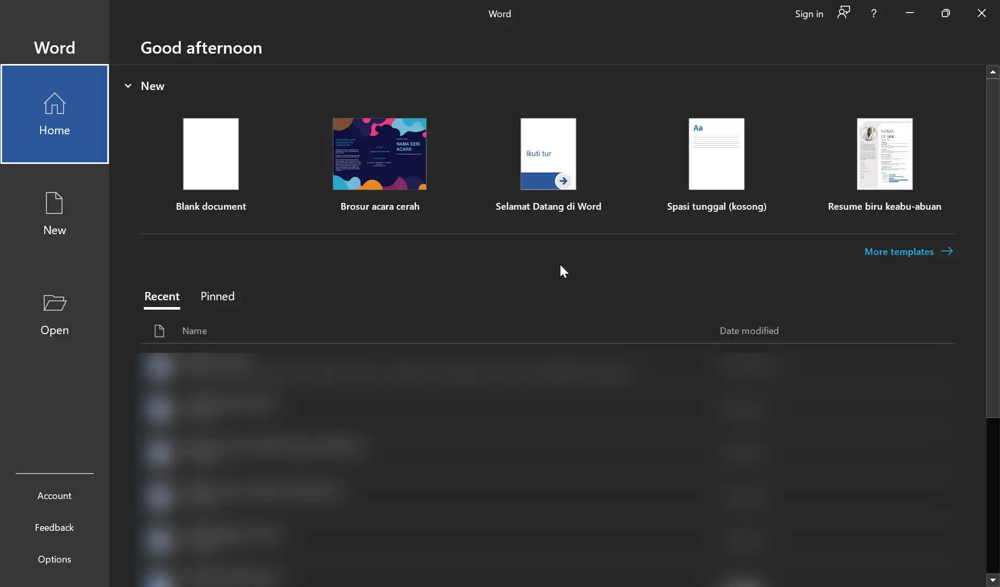
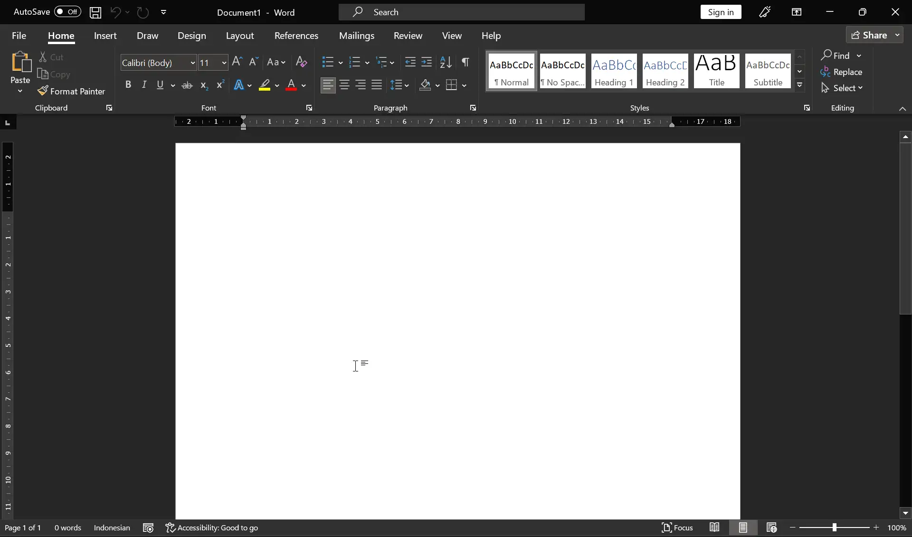
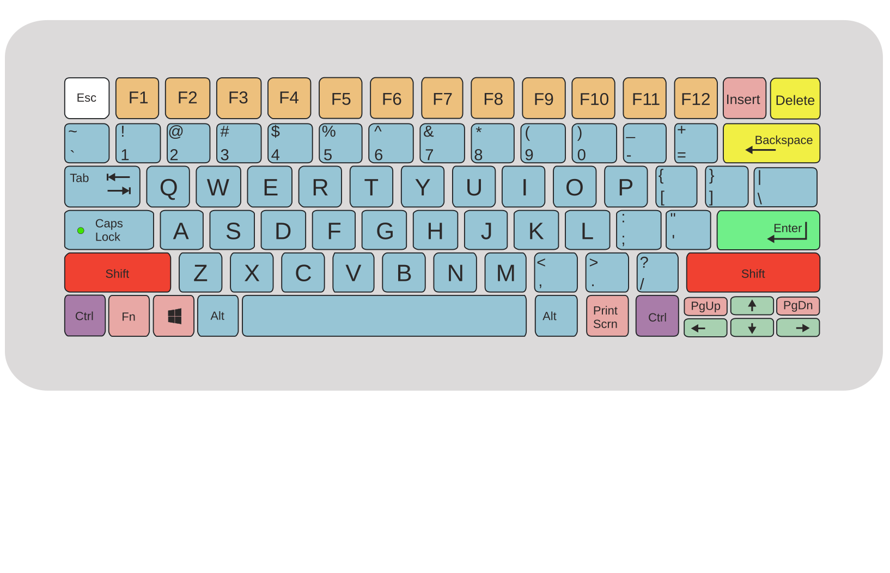
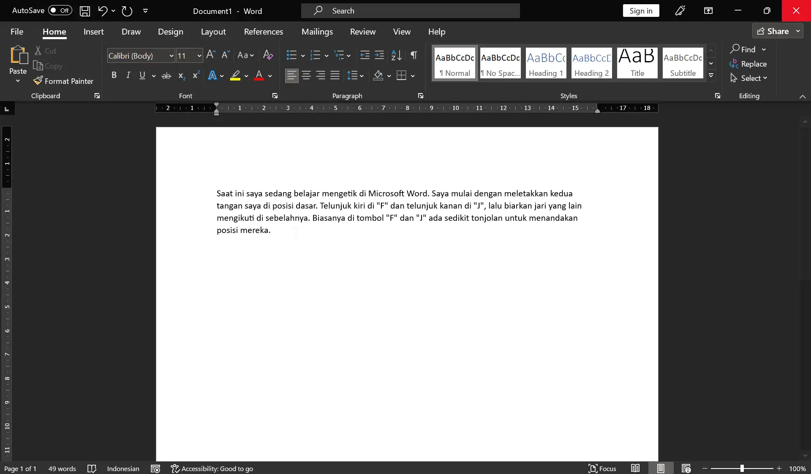
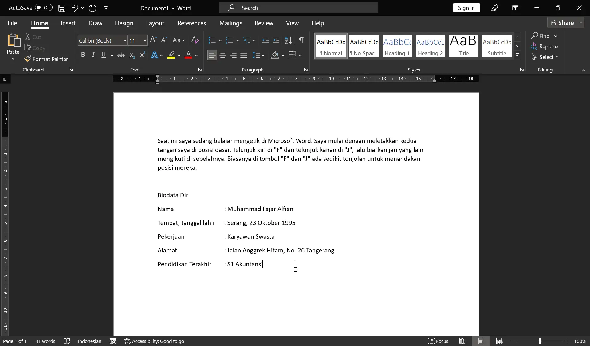
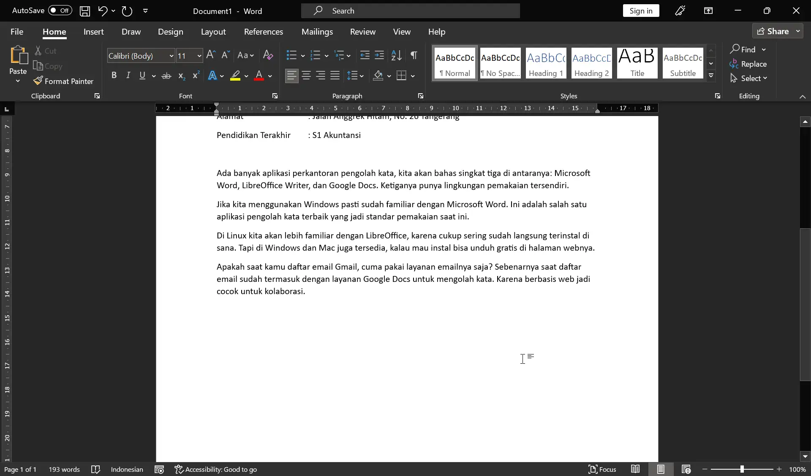

#+title: Memulai Mengetik di Microsoft Word
#+hugo_base_dir: ../../../
#+hugo_section: tutorials/word
#+hugo_bundle: memulai-mengetik
#+export_file_name: index
#+hugo_front_matter_format: yaml

* Pembuka
Pada artikel ini kita akan mempelajari Microsoft Word dari dasar. Mulai dari
membuka aplikasi Microsoft Word, lalu pengenalan beberapa tombol di keyboard
yang cukup penting, dan mencoba latihan mengetik sederhana. Mungkin beberapa hal
di dalam artikel ini sudah cukup familiar bagi kamu, jika benar begitu silakan
melompati bagian tersebut. Namun kalau tidak memberatkan boleh saja dibaca
bagian ini, untuk sekadar menyegarkan ingatan kembali.

* Membuka Word dan Membuat Dokumen Baru

Bukalah aplikasi Microsoft Word dari menu *Start* atau klik dua kali pada
shortcut di desktop. Setelah terbuka tampilan awalnya seperti ini.

#+CAPTION: Tampilan awal Microsoft Word yang baru dibuka

Klik *Blank Document* untuk membuat dokumen baru. Maka akan muncul halaman
kosong seperti ini.

#+CAPTION: Tampilan awal dokumen kosong Microsoft Word

* Pengenalan Beberapa Tombol Keyboard

Sebelum lanjut mengetik dokumen pertama kita, mari mengenal beberapa tombol di
keyboard yang cukup sering digunakan. Berikut ini adalah layout keyboard QWERTY
yang umum digunakan di Indonesia.

#+CAPTION: Layout keyboard QWERTY. Gambar oleh [[https://commons.wikimedia.org/wiki/File:Laptop_Keyboard_Diagram.svg][Mysid]], [[https://creativecommons.org/licenses/by-sa/3.0/deed.en][CC BY-SA 3.0]], via Wikimedia Commons.

** Kursor

*Kursor* adalah garis vertikal tipis berkedip di area dokumen. Dia
menunjukkan posisi huruf berikutnya yang akan diketik. Biasanya huruf akan
ditambahkan pada sebelah kiri kursor, dan kursornya akan terus bergeser ke kanan
selama mengetik. Tapi itu untuk huruf Latin yang ditulisnya dari kiri ke kanan.
Untuk huruf yang ditulis dari kanan ke kiri seperti huruf Arab, huruf tersebut
akan ditambahkan sebelah kanan kursor, dan kursornya akan bergerak ke kiri.

Untuk menggeser posisi kursor, bisa gunakan tombol panah yang ada di kanan bawah
keyboard. Nanti bisa digeser kanan, kiri, atas atau bawah. Atau bisa juga
langsung klik kiri mouse pada posisi yang diinginkan.

Istilah kursor kadang tertukar dengan pointer mouse. Pointer mouse adalah ikon
panah yang mengikuti gerakan mouse. Kadang wujudnya bukan panah, bisa berubah
tergantung situasi.

** Spacebar dan Tab

*Spacebar* adalah tombol paling panjang yang ada di tengah bawah keyboard.
Fungsinya untuk menambahkan spasi yang memisahkan kata.

Tombol *Tab* ada di kiri agak ke atas pada keyboard. Fungsinya untuk memindahkan
kursor ke /tab stop/. Biasanya digunakan saat ingin menambahkan jarak indentasi
pada paragraf atau untuk menyejajarkan titik dua =:= pada daftar isian. Nanti
ada contohnya di latihan.

** Enter

Tombol *Enter* ada di sebelah kanan keyboard. Fungsinya untuk membuat paragraf
baru di bawah tulisan yang tadi kita ketik. Kursor akan pindah ke bawah dan kita
mulai mengetik lagi di sana.

** Backspace dan Delete

Tombol *Backspace* dan *Delete* terletak di kanan atas keyboard. Keduanya
berfungsi untuk menghapus huruf, namun ada perbedaannya. *Backspace* menghapus
huruf yang ada di sebelah kiri kursor. *Delete* menghapus huruf yang di sebelah
kanan kursor.

** Shift dan Caps Lock

Tombol Shift dan Caps Lock umumnya digunakan untuk mengetik huruf kapital,
karena tanpa dua tombol tersebut, huruf yang kita ketik biasanya
adalah huruf kecil. Meskipun fungsi awalnya terlihat mirip, ada beberapa
perbedaan penggunaan dan fungsi tambahan pada kedua tombol itu.

Tombol *Caps Lock* ada di sebelah kiri. Jika tombol ini ditekan sekali kemudian
dilepas, maka semua huruf yang berikutnya kita ketik akan menjadi kapital. Untuk
kembali mengetik huruf kecil, tekan kembali tombol itu.

Tombol *Shift* ada dua, yaitu di kiri dan di kanan, fungsi keduanya sama saja.
Untuk mengetik huruf kapital dengan tombol *Shift*, tekan tombol *Shift*
*bersamaan* dengan huruf yang mau diketik.

Biasanya saat kita mau mengetik nama seseorang, hanya huruf di awal kata yang
memakai huruf kapital. Contohnya kita mau menulis nama =Raihan=, tekan *Shift*
dan huruf =R= bersamaan. Lalu sisa huruf berikutnya =aihan=, diketik biasa tanpa
menekan *Shift*.

Tombol *Shift* selain untuk mengetik huruf kapital, bisa digunakan untuk
mengetik simbol. Coba lihat di keyboard, ada beberapa tombol yang punya dua
baris karakter. Untuk mengetik karakter yang ada di baris atas, tekan *Shift*
bersamaan dengan tombol tersebut.

Misalnya kita mau mengetik tanda seru =!=, tombolnya ada di atas angka *1*. Tekan
*Shift* dan tombol angka *1* yang di atasnya ada tanda seru tersebut.

#+begin_quote
*Tips*

Kedua tombol *Shift* bisa dipakai bergantian. Jika huruf yang mau diketik ada
di sebelah kiri keyboard misalnya "A", tekanlah *Shift* yang di kanan. Begitu
pula sebaliknya.
#+end_quote

** Ctrl dan Alt

Tombol *Ctrl* dan *Alt* ada di bawah keyboard di kiri dan kanan. Mereka biasanya
ditekan bersama tombol lain untuk shortcut. Kita juga akan belajar shortcut yang
umum digunakan, nanti di saat kita memerlukannya.

* Latihan Mengetik

Setelah puas membaca fungsi tombol-tombol di keyboard, sekarang sudah
saatnya kita coba latihan mengetiknya. Latihannya ada tiga tahap, cobalah
dikerjakan berurutan.

** Mengetik Satu Paragraf

Pada latihan ini kita akan membuat satu paragraf yang terdiri dari beberapa
baris kalimat. Kita juga akan mulai mengenal konsep /word wrap/.

*Instruksi!*: Cobalah ketik teks di bawah ini tanpa menekan tombol *Enter*.
Biarkan teks yang diketik turun sendiri membuat baris baru di bawahnya.

#+begin_quote
Saat ini saya sedang belajar mengetik di Microsoft Word. Saya mulai dengan
meletakkan kedua tangan saya di posisi dasar. Telunjuk kiri di "F" dan telunjuk
kanan di "J", lalu biarkan jari yang lain mengikuti di sebelahnya. Biasanya di
tombol "F" dan "J" ada sedikit tonjolan untuk menandakan posisi mereka.
#+end_quote

*Hal-hal yang perlu diperhatikan*:
1. Gunakan tombol *Shift* untuk mengetik huruf kapital. Boleh pakai *Caps
   Lock*, tapi perhatikan kapan tombol itu ditekan lagi.
2. Ada tanda kutip dua ="=, dan itu perlu tombol *Shift*.
3. Jika ada salah ketik, gunakan *Backspace* untuk menghapus huruf di sebelah
   kiri kursor, atau *Delete* bila mau menghapus huruf di sebelah kanan kursor.
4. Jika salah ketiknya baru kamu ketahui setelah selesai mengetik, kamu bisa
   arahkan kursor kembali ke tempat yang salah dan hapus. Untuk memindahkan
   posisi kursor, gunakan tombol panah atau kamu bisa langsung klik kiri pada
   huruf yang salah.

Nanti hasil akhirnya akan jadi seperti ini.

#+CAPTION: Hasil latihan mengetik satu paragraf

Pada baris pertama setelah saya mengetik kata =kedua=, kata =tangan= akan
otomatis pindah ke bawah. Inilah contoh dari /word wrap/, Word akan secara
otomatis memindahkan kata ke baris di bawahnya bila kata itu sudah tidak muat
lagi ke samping.

Mungkin pada latihan yang kamu kerjakan, letak kata-katanya tidak sama persis
dengan hasil yang saya tampilkan, tapi itu tidak masalah. Perbedaan itu bisa
terjadi karena font, ukuran huruf, atau margin di Word kamu punya pengaturan
yang berbeda. Kamu tidak perlu mengubah semua pengaturan itu dahulu, karena pada
latihan ini saya hanya ingin menunjukkan konsep /word wrap/ saja. Tiga
pengaturan itu akan kita bahas pada artikel-artikel berikutnya.

** Mengetik Beberapa Baris

Pada latihan ini kita akan membuat potongan data pada formulir yang terdiri dari
beberapa baris. Kita bisa melanjutkan ini di bawah latihan pertama, jadi tekan
*Enter* dua kali untuk pindah ke baris baru dan memberi jarak satu baris kosong.

*Instruksi*: Ketiklah teks di bawah ini. Dan kali ini tekan *Enter* bila teks
pada baris itu telah selesai agar bisa lanjut ke paragraf baru di bawahnya.

#+begin_quote
Biodata Diri

Nama                     : Muhammad Fajar Alfian

Tempat, tanggal lahir    : Serang, 23 Oktober 1995

Pekerjaan                : Karyawan Swasta

Alamat                   : Jalan Anggrek Hitam, No. 26 Tangerang

Pendidikan Terakhir      : S1 Akuntansi
#+end_quote

*Hal-hal yang perlu diperhatikan*:
1. Jangan lupa untuk menekan *Enter* setiap ingin membuat paragraf baru ke
   bawah.
2. Ratakan posisi titik dua =:= setiap baris menggunakan tombol *Tab*. Dan
   mungkin kamu perlu menekannya beberapa kali agar posisinya sejajar dengan
   baris yang lain.

Hasilnya akan jadi seperti ini:

#+CAPTION: Hasil latihan mengetik beberapa baris teks

Di sini kita telah mengetik enam baris teks. Apakah teks yang kamu ketik sudah
sama seperti hasil di atas? Seharusnya tidak banyak perbedaan besar, karena teks
perbarisnya tidak banyak. Bila ada sedikit perbedaan tidak masalah, karena yang
ingin dicapai pada latihan ini adalah mengetik teks beberapa baris dan meratakan
titik dua dengan *Tab*.

*Tab* bukan satu-satunya cara untuk meratakan posisi titik dua dalam dokumen,
masih ada cara yang lain, namun *Tab* adalah cara yang paling sering saya
temukan pada pengaturan dokumen sederhana. Bila ada kesempatan kita juga bisa
bahas cara lain itu nanti.

#+begin_quote
*Tentang Paragraf dan Baris*

Selama ini kita menganggap bahwa paragraf adalah kumpulan teks panjang yang
terdiri dari beberapa baris, saya pun dulu begitu. Tapi pada aplikasi pengolah
kata, batas paragraf itu ditentukan oleh di mana kita menekan *Enter*. Jadi satu
kata pun, bila diakhirnya kita menekan *Enter*, sudah dianggap satu paragraf
sendiri.
#+end_quote

** Mengetik Beberapa Paragraf

Pada latihan ini kita akan membuat beberapa paragraf. Kita akan melihat /word
wrap/ pada lebih dari satu paragraf, serta kita akan menggunakan *Tab* untuk
indentasi pada baris pertama paragraf. Kita lanjutkan lagi latihan ini di bawah
latihan sebelumnya, jadi tekan *Enter* dua kali untuk pindah ke baris baru dan
memberi jarak satu baris kosong.

*Instruksi*: Ketiklah teks di bawah ini. Tekan *Tab* pada awal paragraf untuk
membuat indentasi baris pertama. Tekan *Enter* hanya saat membuat paragraf baru.

#+begin_quote
Ada banyak aplikasi perkantoran pengolah kata, kita akan bahas singkat tiga
di antaranya: Microsoft Word, LibreOffice Writer, dan Google Docs. Ketiganya
punya lingkungan pemakaian tersendiri.

Jika kita menggunakan Windows pasti sudah familiar dengan Microsoft Word. Ini
adalah salah satu aplikasi pengolah kata terbaik yang jadi standar pemakaian
saat ini.

Di Linux kita akan lebih familiar dengan LibreOffice, karena cukup sering sudah
langsung terinstal di sana. Tapi di Windows dan Mac juga tersedia, kalau mau
instal bisa unduh gratis di halaman webnya.

Apakah saat kamu daftar email Gmail, cuma pakai layanan emailnya saja?
Sebenarnya saat daftar email sudah termasuk dengan layanan Google Docs untuk
mengolah kata. Karena berbasis web jadi cocok untuk kolaborasi.
#+end_quote

Hasilnya nanti seperti ini:

#+CAPTION: Hasil latihan mengetik beberapa paragraf

Bagaimana hasil yang kamu ketik? Kalau letak kata-katanya tidak sama persis,
tidak masalah, karena yang ingin ditunjukkan adalah /word wrap/ dari beberapa
paragraf seperti di latihan pertama.

Kita juga sudah menggunakan *Tab* untuk membuat indentasi baris pertama yang
masuk ke kanan. *Tab* ini hanyalah cara cepat bila dokumennya pendek. Untuk
dokumen panjang ada pengaturan untuk indentasi banyak paragraf sekaligus, jadi
kita tidak perlu menekan *Tab* setiap buat paragraf baru, karena selain
merepotkan, rawan juga kelupaan. Kita akan pelajari itu di beberapa materi
berikutnya.

* Kesalahan Umum

Ada beberapa kesalahan umum yang pernah saya temukan dalam mengetik dokumen.

** Menekan Enter pada akhir baris

Kita tidak perlu menekan *Enter* saat ingin pindah ke baris bawah bila teks yang
kita ketik masih ada di dalam paragraf yang sama. Biarkan ketikan itu mengalir
apa adanya karena ada fitur /word wrap/ yang otomatis memindahkan teks itu ke
bawah. Kalau kita menekan *Enter*, baris berikutnya akan jadi paragraf terpisah.

** Menggunakan spasi untuk mengatur jarak titik dua

Kalau menggunakan spasi, posisi titik dua yang berbeda baris bisa tidak sejajar.
Gunakan *Tab* untuk mengatur jarak titik dua pada beberapa baris sejajar.

* Penutup

Pada artikel pertama ini, kita sudah bisa mengetik, mengenal beberapa tombol
penting di keyboard, memperbaiki kesalahan dalam pengetikan, serta membuat
paragraf. Tapi jangan ditutup dulu Word-nya, karena kita perlu menyimpan latihan
ini, agar bisa dibuka kembali nanti.

Pada artikel berikutnya kita akan belajar cara menyimpan dokumen yang sudah
dibuat.
